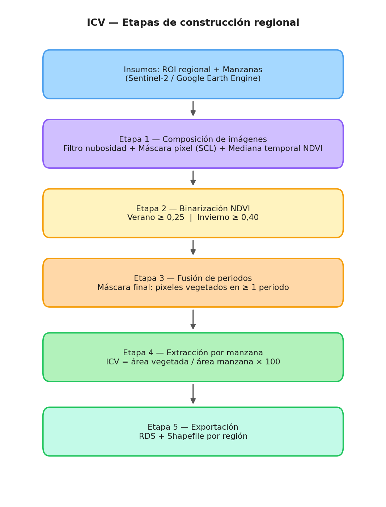
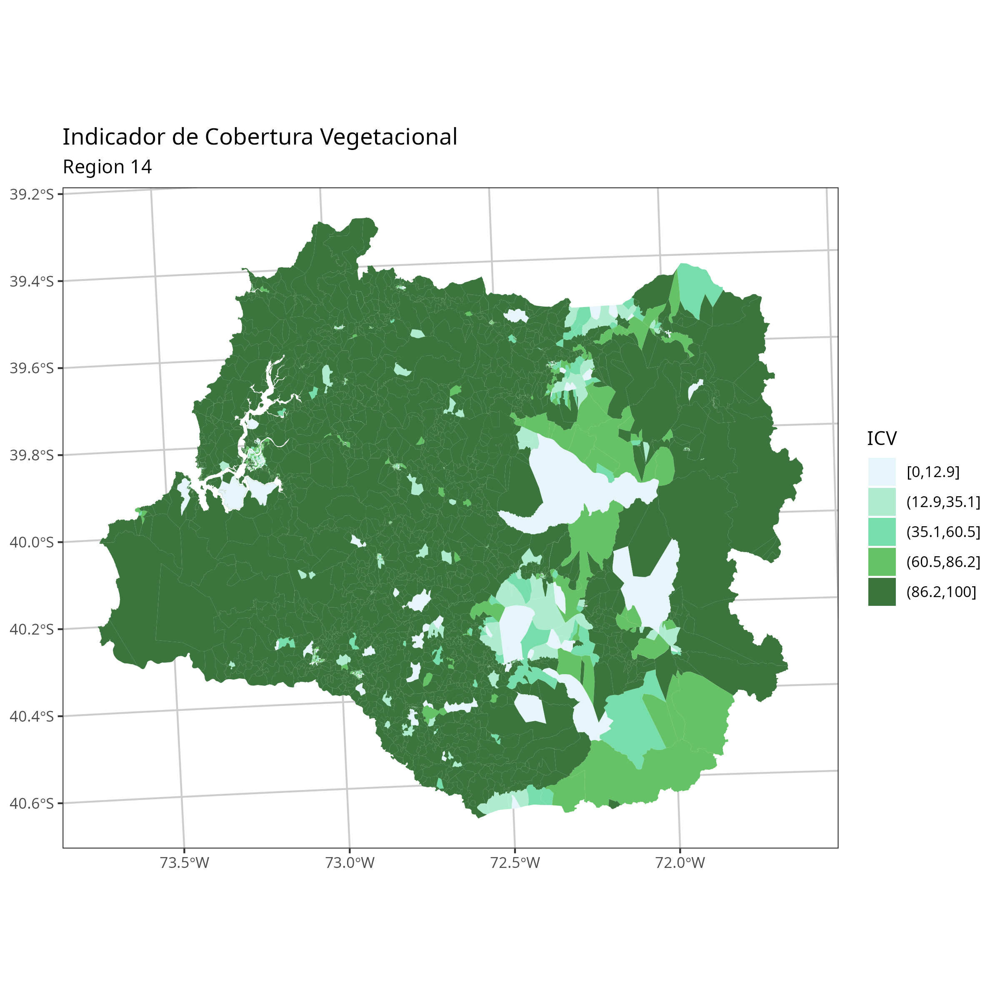
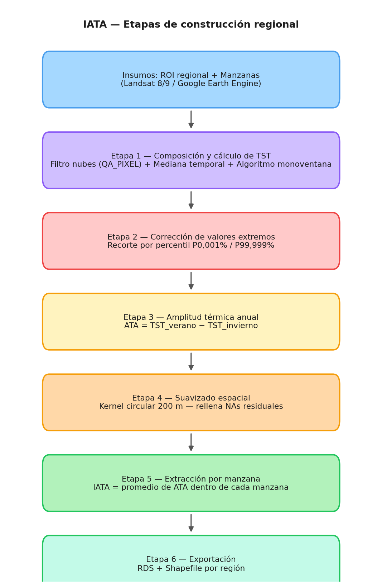
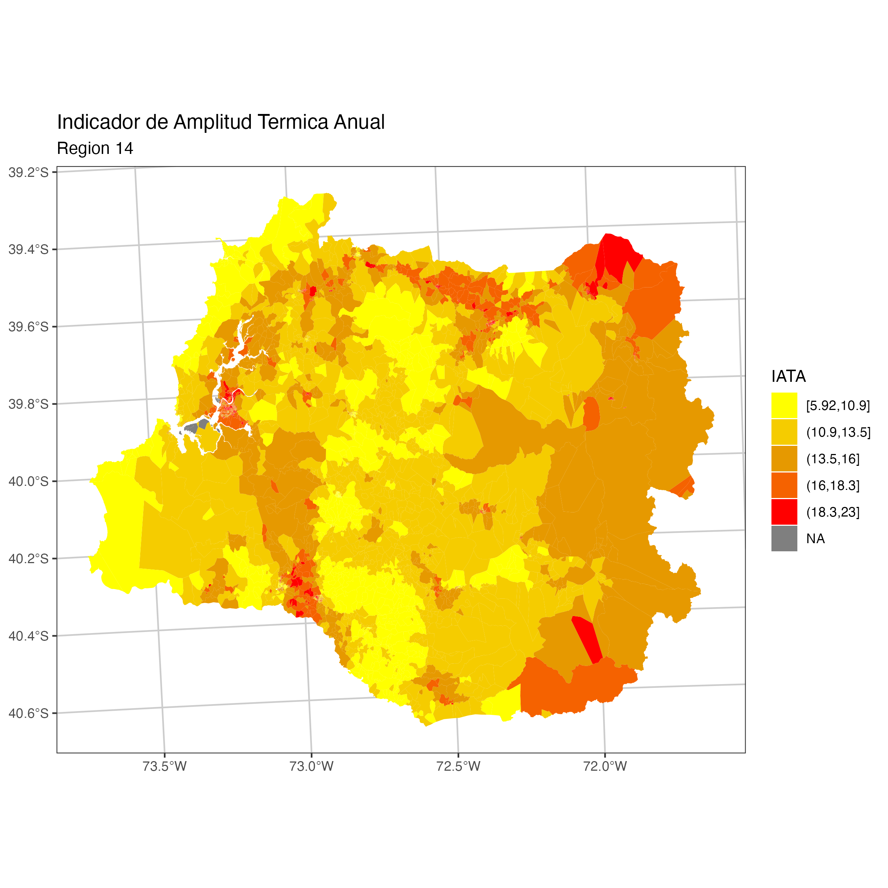

## Presentación de la dimensión {#sec-presentacion}

La dimensión ambiental de la Matriz de Bienestar Humano Territorial (MBHT) busca capturar la calidad del entorno natural que rodea a las personas en sus territorios de vida cotidiana. A diferencia de otras dimensiones que se nutren principalmente de registros administrativos o encuestas, esta dimensión se construye a partir de imágenes satelitales de acceso libre, lo que permite actualizar los indicadores de forma periódica y con cobertura nacional completa, incluyendo localidades rurales que carecen de estadísticas convencionales.

La dimensión se compone de dos indicadores complementarios que, juntos, ofrecen una lectura del bienestar ambiental a escala de barrio. El primero mide la presencia de vegetación en el entorno inmediato de cada unidad territorial, entendida como un bien que regula el microclima, reduce el estrés urbano y proporciona servicios ecosistémicos. El segundo mide la amplitud con que oscila la temperatura superficial entre las estaciones extremas del año, como expresión de la resiliencia o vulnerabilidad térmica del territorio. Ambos indicadores se calculan de forma independiente y para cada región del país por separado, siguiendo la misma lógica de construcción.

La unidad de análisis es la **manzana** en zonas urbanas y la **entidad** en zonas rurales, abarcando así la totalidad del territorio regional. Esta escala mínima permite detectar desigualdades ambientales incluso dentro de una misma ciudad o localidad.

## Indicador de Cobertura Vegetal (ICV) {#sec-icv}

### Fundamento conceptual

El Índice de Cobertura Vegetal (ICV) expresa qué fracción del área de cada manzana está cubierta por vegetación. La cobertura vegetal urbana y periurbana cumple múltiples funciones que inciden directamente en el bienestar de las personas: modera la temperatura local, filtra contaminantes, reduce el ruido, provee sombra y, en términos psicológicos, ha sido asociada sistemáticamente con mejores indicadores de salud mental y percepción de seguridad. La distribución de este bien no es neutral: tiende a concentrarse en zonas de mayor ingreso, por lo que su medición sistemática permite identificar territorios en desventaja ambiental y orientar políticas de recuperación del espacio verde.

El indicador asume un rango continuo de 0 a 100, donde 0 representa la ausencia completa de vegetación en la manzana y 100 indica que toda su superficie está cubierta. Esta escala facilita la comparación entre territorios y la construcción de percentiles regionales para la normalización posterior dentro de la MBHT.

### Fuente de datos y criterio de detección

La fuente principal es la colección de imágenes satelitales **Sentinel-2** del programa Copernicus, de la Agencia Espacial Europea. Esta plataforma ofrece imágenes multiespectrales con una resolución espacial de 10 metros y una frecuencia de revisita de aproximadamente cinco días, condiciones que la hacen idónea para el monitoreo de cobertura vegetal a escala de barrio.

La detección de vegetación se basa en el **Índice de Vegetación de Diferencia Normalizada** (NDVI, por sus siglas en inglés). El NDVI aprovecha la propiedad de la vegetación activa de reflejar intensamente la radiación infrarroja cercana y absorber la radiación roja visible: cuanto mayor es la diferencia entre ambas bandas espectrales, mayor es la cantidad y vigor de la vegetación presente. Formalmente, el índice se define como:

$$
\text{NDVI} = \frac{\rho_{NIR} - \rho_{Red}}{\rho_{NIR} + \rho_{Red}}
$$

donde $\rho_{NIR}$ y $\rho_{Red}$ son las reflectancias superficiales en las bandas infrarroja cercana (Banda 8, 842 nm) y roja (Banda 4, 665 nm) de Sentinel-2, respectivamente.

Para clasificar un píxel como "cubierto por vegetación", se aplica un umbral de NDVI diferenciado por estación del año. Dado que el análisis corresponde a Chile, los periodos respetan los meses estándar de **verano** e **invierno** del hemisferio sur. Se requiere que el píxel supere el umbral mínimo de NDVI en al menos uno de los dos periodos:

- En el **período estival**, se utiliza un umbral regional definido a partir de la experiencia analítica y la inspección visual de la respuesta espectral de la cobertura vegetal en cada territorio.
- En el **período invernal**, se aplica igualmente un umbral regional, ajustado según la experiencia y la inspección visual, para distinguir con mayor certeza la vegetación persistente respecto de otras coberturas con comportamiento espectral similar en la estación fría.

La combinación de ambos periodos es deliberada: permite capturar tanto la vegetación de ciclo anual, que sólo es detectable en verano, como la vegetación perenne o de floración invernal, que domina en las zonas templadas y lluviosas del país. Un píxel que supera el umbral en cualquiera de los dos periodos queda clasificado como cubierto.

### Etapas de construcción regional

El proceso de cálculo se organiza en cinco etapas sucesivas que se repiten para cada región del país. La @fig-icv-etapas resume el flujo completo.

{#fig-icv-etapas fig-align="center" width="75%"}

**Etapa 1 — Composición de imágenes satelitales.** Para cada periodo (estival e invernal), se reúne en la plataforma Google Earth Engine (GEE) el conjunto de escenas Sentinel-2 disponibles dentro de las fechas de análisis, filtradas por la región de interés. Cada escena pasa por un filtro de calidad que descarta aquellas con alto porcentaje de cobertura nubosa global, y luego se aplica una máscara de nubes píxel a píxel usando la banda de clasificación de escena (SCL) que provee el propio sensor. A partir de las escenas limpias se calcula un **composite de mediana temporal**: para cada píxel, el valor de NDVI resultante es la mediana de todos los valores válidos observados durante el periodo. El uso de la mediana —en lugar del promedio— garantiza robustez frente a valores atípicos ocasionales que pueden persistir aun después del enmascaramiento de nubes.

**Etapa 2 — Binarización.** El raster de NDVI mediano se descarga localmente y se convierte en una imagen binaria: cada píxel recibe el valor 1 si supera el umbral correspondiente al periodo, y 0 en caso contrario. Esta operación se repite de forma independiente para el periodo estival y el invernal.

**Etapa 3 — Fusión de periodos.** Las dos imágenes binarias se suman píxel a píxel. Todo píxel que sume 1 o más (es decir, que haya superado el umbral en al menos un periodo) queda clasificado como vegetado en la máscara final. Esta imagen binaria consolidada representa la distribución espacial de la vegetación activa a lo largo del año.

**Etapa 4 — Extracción por manzana.** Usando herramientas de extracción de estadísticas zonales, se calcula para cada manzana la proporción del área interna cubierta por píxeles con valor 1 en la máscara binaria. El resultado es el ICV de esa manzana, expresado como porcentaje:

$$
\text{ICV} = \frac{\text{Área de píxeles con vegetación}}{\text{Área total de la manzana}} \times 100
$$

**Etapa 5 — Exportación.** Los resultados se almacenan vinculados a la geometría de cada manzana, lo que permite su visualización cartográfica directa y su incorporación posterior a la MBHT.

La @fig-icv-r14 muestra el resultado del ICV para la Región de Los Ríos (R14) como ejemplo de los productos cartográficos generados.

{#fig-icv-r14 fig-align="center" width="90%"}

## Indicador de Amplitud Térmica Anual (IATA) {#sec-iata}

### Fundamento conceptual

El Índice de Amplitud Térmica Anual (IATA) mide la diferencia entre la temperatura superficial del territorio (TST) en el verano y en el invierno. Esta diferencia refleja cuánto oscila térmicamente la superficie de cada unidad territorial a lo largo del ciclo anual, y constituye un indicador del estrés térmico que experimenta ese territorio y, por extensión, la población que lo habita.

Una amplitud elevada señala zonas con alta inercia térmica negativa: superficies que se calientan intensamente en verano y se enfrían abruptamente en invierno. Esto es característico de áreas con alta densidad de superficies impermeables —pavimento, cubiertas metálicas, techos de hormigón— y escasa vegetación, condición frecuente en barrios vulnerables con déficit de espacio verde. Por el contrario, una amplitud reducida indica mayor estabilidad térmica estacional, asociada a suelos permeables, arbolado denso y buenas condiciones de regulación hídrica del entorno.

El IATA se define como:

$$
\text{IATA} = \overline{TST}_{verano} - \overline{TST}_{invierno} \quad [°C]
$$

donde $\overline{TST}$ es la temperatura superficial promedio dentro de cada manzana para el periodo correspondiente. Al igual que en el ICV, los periodos de referencia corresponden a los meses estándar de **verano** e **invierno** del hemisferio sur. Valores positivos —los habituales en cualquier punto del territorio nacional— indican que la superficie es más cálida en el verano austral que en el invierno austral. El interés analítico no está en el signo sino en la magnitud relativa entre territorios: una manzana con IATA de 25 °C experimenta un régimen térmico mucho más extremo que una con IATA de 12 °C en la misma ciudad.

### Fuente de datos y método de cálculo de la temperatura superficial

La fuente de datos es la colección de imágenes **Landsat 8 y 9** (USGS), que dispone de una banda térmica de onda larga (Banda 10) con resolución espacial de 30 metros y frecuencia de revisita de 16 días. Si bien la resolución es menor que la de Sentinel-2, la banda térmica de Landsat es el sensor de acceso libre con mejor balance entre resolución, cobertura temporal y profundidad histórica del archivo disponible.

La temperatura superficial del territorio (TST) no se obtiene directamente de la radiancia registrada por el sensor, sino que debe calcularse corrigiendo el efecto de la emisividad de la superficie, que varía según el tipo de cubierta. El procedimiento aplica un **algoritmo monoventana simplificado** basado en el trabajo de Sobrino et al. (2004), ampliamente utilizado en la literatura de teledetección urbana. Los pasos son los siguientes:

1. A partir de la Banda 10 (radiancia TOA), se calcula la **temperatura de brillo** (BT), que corresponde a la temperatura que tendría un cuerpo negro que emitiese la misma radiancia.
2. Se calcula el NDVI desde las bandas 4 (roja) y 5 (infrarroja cercana) del mismo sensor, para estimar la fracción de cobertura vegetal ($FV$) de cada píxel.
3. La **emisividad superficial** ($\varepsilon$) se estima a partir de $FV$ mediante la expresión lineal: $\varepsilon = 0{,}004 \cdot FV + 0{,}986$, que asigna mayor emisividad a los píxeles con mayor presencia vegetal.
4. Con la temperatura de brillo y la emisividad estimada, se corrige la temperatura superficial real (TST) convirtiendo el resultado a grados Celsius.

Este cálculo se realiza íntegramente en la plataforma GEE antes de exportar los rasters, lo que reduce el volumen de datos transferidos y concentra el procesamiento en la infraestructura de nube del proveedor.

### Etapas de construcción regional

La construcción del IATA sigue una secuencia similar a la del ICV, pero incorpora etapas adicionales para la corrección de anomalías térmicas y la imputación espacial de datos faltantes. La @fig-iata-etapas resume el flujo completo, que consta de seis pasos.

{#fig-iata-etapas fig-align="center" width="75%"}

**Etapa 1 — Composición de imágenes y cálculo de TST.** Para cada periodo (estival e invernal), se reúnen las escenas Landsat disponibles sobre la región, se filtran por cobertura nubosa global y se aplica una máscara de nubes píxel a píxel usando la banda de calidad QA_PIXEL. A partir de las escenas válidas se genera un composite de mediana temporal, sobre el cual se calcula la TST según el procedimiento descrito anteriormente. El composite resultante es un raster continuo de temperaturas superficiales en grados Celsius.

**Etapa 2 — Corrección de valores extremos.** Los composites de temperatura pueden contener píxeles con valores físicamente imposibles, producidos por saturación del sensor, reflexión especular de nubes no enmascaradas o artefactos en los bordes de las escenas. Para eliminar estas anomalías sin afectar la distribución real de temperaturas, se aplica un criterio de recorte por percentiles extremos: los píxeles que caen por debajo del percentil 0,001 % o por encima del percentil 99,999 % se marcan como valores faltantes. La elección de percentiles tan extremos —que en un raster de 40 millones de píxeles equivale a los 400 valores más alejados de cada cola— garantiza que sólo se eliminen anomalías claras, sin alterar la distribución estadística del indicador.

**Etapa 3 — Cálculo de la amplitud térmica.** Los rasters de TST estival e invernal, ya corregidos, se restan píxel a píxel para obtener un raster de amplitud térmica anual. Esta operación es directa y produce valores positivos en prácticamente todo el territorio nacional.

**Etapa 4 — Suavizado espacial e imputación de faltantes.** Los píxeles marcados como faltantes —ya sea por nubes persistentes o por corrección de outliers— se imputan mediante un **kernel circular de 200 metros de radio**: para cada píxel faltante se calcula el promedio ponderado de los píxeles válidos en su vecindad. Esta técnica de interpolación local es adecuada para la temperatura superficial porque la variable tiene alta autocorrelación espacial: la temperatura de un punto tiende a ser muy similar a la de sus vecinos inmediatos. El radio de 200 metros equivale a poco más de seis píxeles de Landsat, lo que garantiza que la imputación use información de la misma unidad de paisaje y no de sectores con condiciones de superficie distintas.

**Etapa 5 — Extracción por manzana y exportación.** Para cada manzana, se calcula el promedio de los valores de amplitud térmica de todos los píxeles contenidos en ella. Este valor medio constituye el IATA de la manzana. Los resultados se exportan vinculados a la geometría de cada manzana, en el mismo formato que el ICV.

La @fig-iata-r14 muestra el resultado del IATA para la Región de Los Ríos (R14) como ejemplo de los productos cartográficos generados.

{#fig-iata-r14 fig-align="center" width="90%"}

## Construcción regional y criterios de homologación {#sec-regional}

Ambos indicadores se calculan de forma independiente para cada una de las 16 regiones del país. Esta decisión no es meramente operativa: responde a criterios de coherencia metodológica. Las condiciones ambientales, la fenología de la vegetación y el régimen térmico varían sustancialmente entre regiones. Calcular umbrales o distribuciones de referencia a nivel nacional produciría comparaciones distorsionadas entre territorios cuyas condiciones naturales de base son incomparables. Al construir los indicadores por región, los valores resultantes son coherentes dentro de cada contexto biogeográfico.

Una vez calculados los indicadores brutos, la incorporación a la MBHT requiere una normalización que permita comparar territorios entre sí y agregar los valores dentro de la dimensión ambiental. Este proceso de normalización, que transforma los indicadores a una escala común, se describe en el capítulo metodológico transversal de la matriz.

## Actualizaciones de la versión 2025 {#sec-actualizaciones}

La versión 2025 de los indicadores ambientales incorpora un conjunto de mejoras respecto de la versión anterior, motivadas tanto por la necesidad de ampliar la cobertura geográfica hacia las regiones australes del país como por la incorporación de nuevas estrategias de robustez frente a la pérdida de datos por nubosidad.

### Adaptación a regiones con alta nubosidad persistente

Las regiones de Los Lagos (R10), Aysén (R11), Magallanes (R12) y Los Ríos (R14) presentan un régimen climático caracterizado por precipitaciones frecuentes y cobertura nubosa elevada durante gran parte del año. Esta condición hacía que con los umbrales de nubosidad aplicados en versiones anteriores, una fracción importante de las escenas disponibles fuera descartada, llegando en algunos casos a periodos sin ninguna observación válida. Para dar respuesta a este desafío, la versión 2025 implementa umbrales diferenciados: mientras que en el resto del país se admiten escenas con hasta un 10 % de cobertura nubosa global en el periodo estival y un 30 % en el invernal, en las regiones australes estos límites se elevan a 50 % y 60 % respectivamente, lo que amplía significativamente el conjunto de escenas disponibles para construir el composite.

El mismo ajuste se aplica para los composites de temperatura (IATA): en las regiones australes se acepta hasta un 50 % de cobertura nubosa en verano y un 60 % en invierno, frente al 30 % y 40 % que rigen en el resto del país.

### Procesamiento por unidades comunales

Las regiones de gran extensión territorial —en particular Aysén y Magallanes— superan los límites prácticos del procesamiento como una única tarea en GEE, lo que generaba errores de tiempo de espera y dificultaba la descarga de imágenes. La solución adoptada consiste en dividir el territorio regional en sus comunas constituyentes y procesar cada una de forma independiente. Para cada comuna se construye un composite propio con el conjunto de escenas disponibles en su área de influencia, lo que además permite que el filtrado por nubosidad sea sensible a las condiciones locales de cobertura. Los rasters comunales se ensamblan posteriormente en un mosaico regional único, que es el insumo para la extracción de estadísticas por manzana. Este esquema no sólo resuelve el problema de escala sino que mejora la calidad de los composites en regiones con heterogeneidad climática interna.

### Mecanismo de respaldo por año anterior (*fallback*)

Incluso con umbrales ampliados y procesamiento comunal, algunas zonas pueden no contar con ninguna observación libre de nubes en el periodo de análisis. Para evitar que estas zonas queden sin valor en el indicador, se implementó un mecanismo de respaldo automático: cuando un píxel carece de observación válida en el año de análisis, se sustituye por el valor del composite del mismo periodo del año inmediatamente anterior. Esta sustitución opera a nivel de píxel y de forma transparente: sólo reemplaza los valores ausentes, sin modificar los píxeles que sí cuentan con dato del año en curso. El supuesto subyacente —que la cobertura vegetal y el régimen térmico estacional son relativamente estables de un año a otro en estas zonas— es plausible dado que la vegetación dominante en las regiones australes es bosque nativo adulto, con ciclos plurianuales. Tras la aplicación del respaldo, los porcentajes residuales de valores faltantes reportados han sido inferiores al 0,05 % en todas las regiones procesadas.

### Actualización del año de referencia y selección de sensor

Los periodos de análisis corresponden al ciclo climático 2024–2025 y respetan el calendario estacional del hemisferio sur. Para la totalidad de las regiones del país, ambos indicadores se construyen usando los meses estándar de **verano** e **invierno**. De forma excepcional, en las regiones australes con cobertura nubosa persistente estas ventanas pueden ampliarse para incorporar un mayor número de píxeles satelitales útiles para el cálculo, sin que ello modifique el significado estacional del indicador.

En cuanto a la selección del sensor, ambos satélites de la serie Landsat actualmente operativos —Landsat 8 y Landsat 9, lanzado en septiembre de 2021— se consideran intercambiables para este propósito. Los datos de Landsat 9 son virtualmente idénticos en calibración a los de Landsat 8, por lo que la elección entre uno y otro en cada ejecución depende de la disponibilidad de escenas en el año de análisis.

---

::: {.callout-note}
## Nota sobre la escala de análisis

Ambos indicadores se calculan a la escala de la manzana en zonas urbanas y de la entidad en zonas rurales, cubriendo la totalidad del territorio regional. Estas son las unidades territoriales mínimas de trabajo y son las mismas que las del resto de indicadores de la MBHT, lo que garantiza la coherencia espacial al momento de agregar la dimensión ambiental a la matriz.
:::

::: {.callout-tip}
## Sobre la comparabilidad interanual

Al actualizar los indicadores en ediciones futuras de la MBHT, es importante mantener los mismos periodos estacionales de referencia y los mismos umbrales de clasificación para garantizar la comparabilidad de los resultados a lo largo del tiempo. Cambios en los umbrales de NDVI o en las ventanas temporales de los composites pueden producir variaciones en los valores del indicador que no reflejan cambios reales en el territorio.
:::
