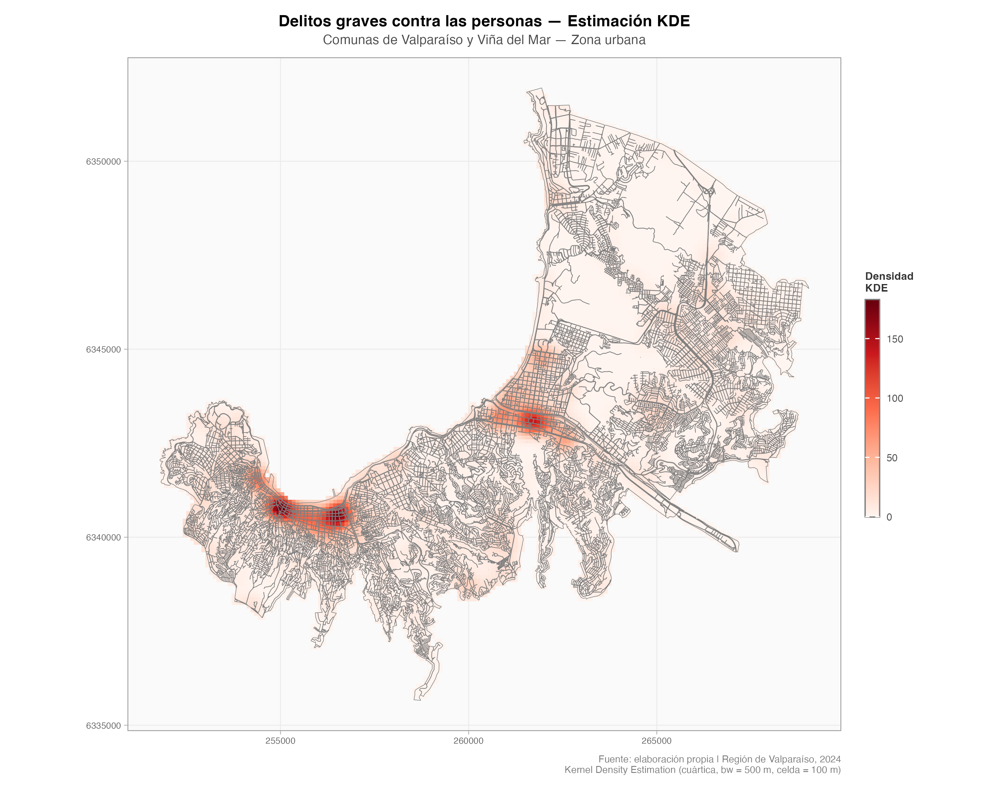
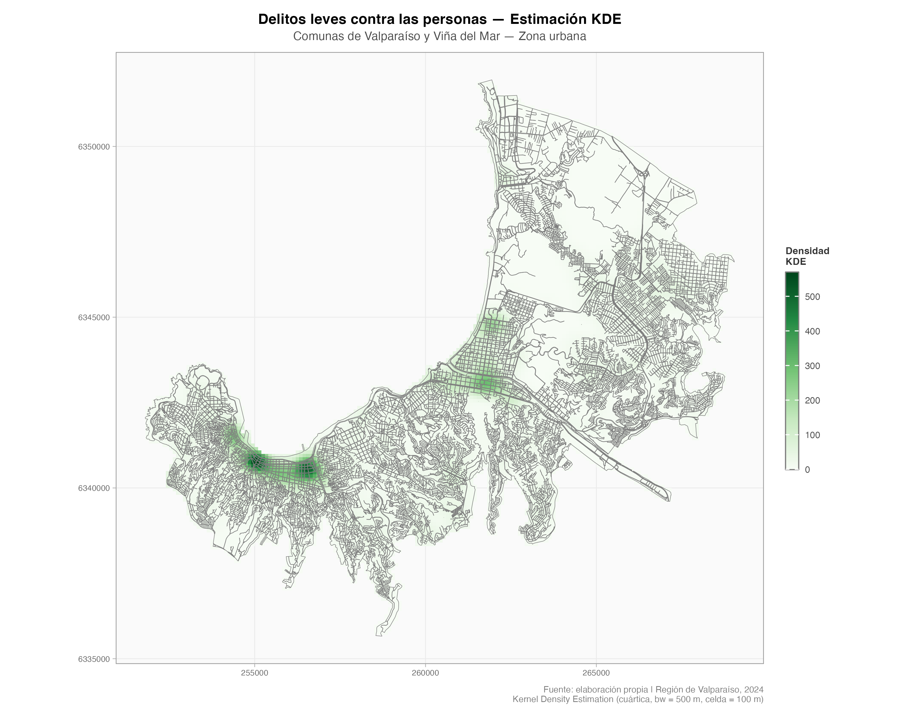
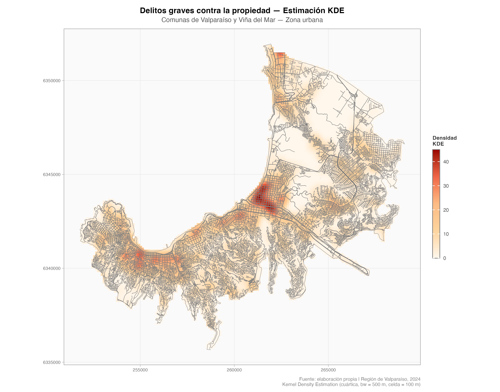
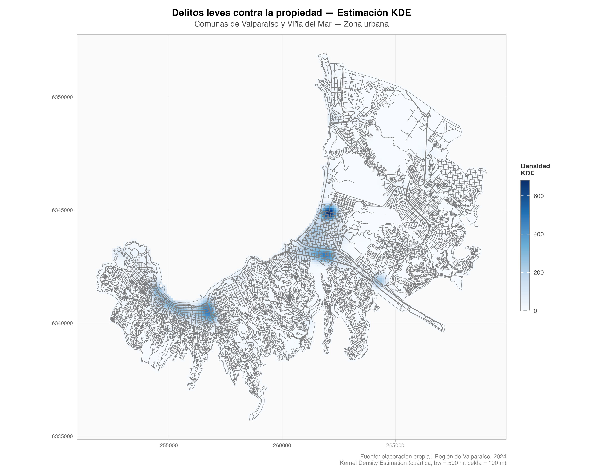
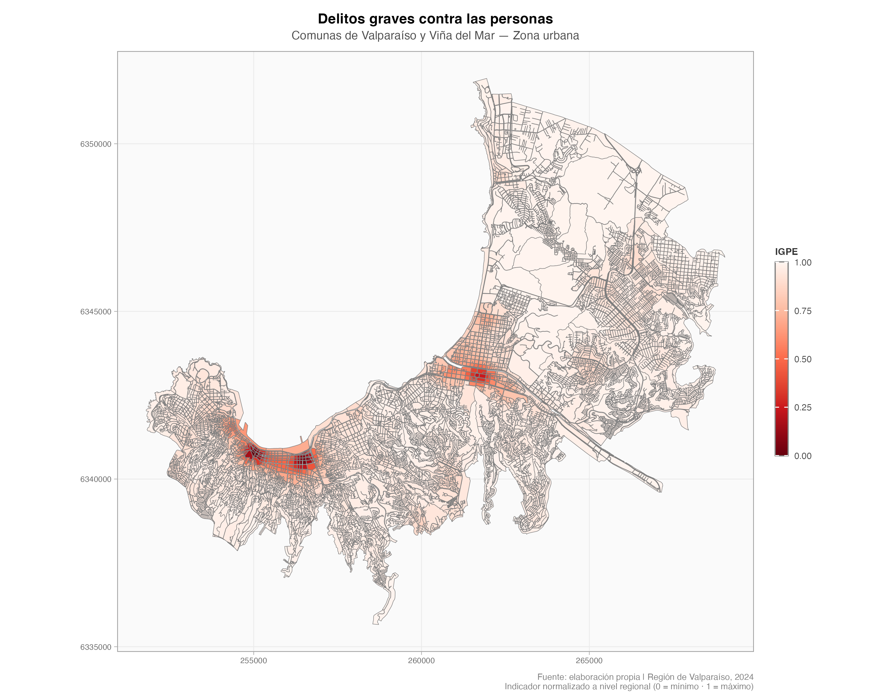
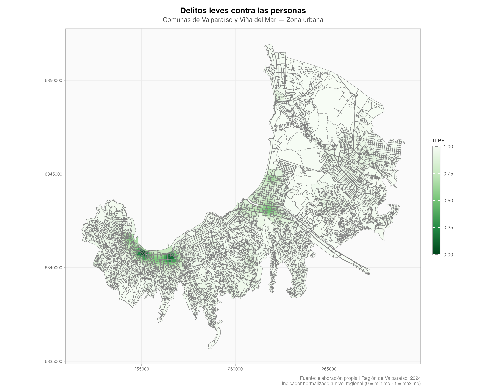
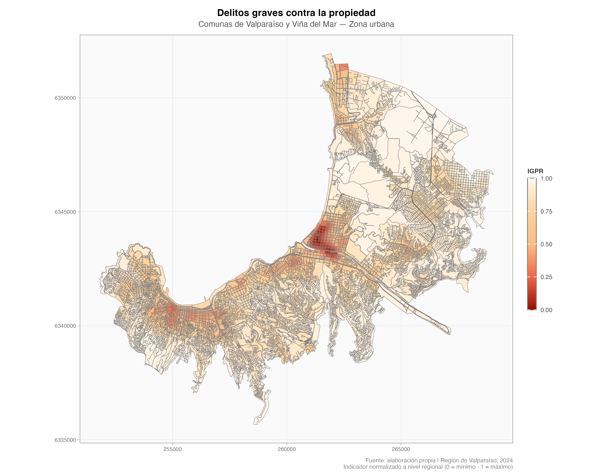
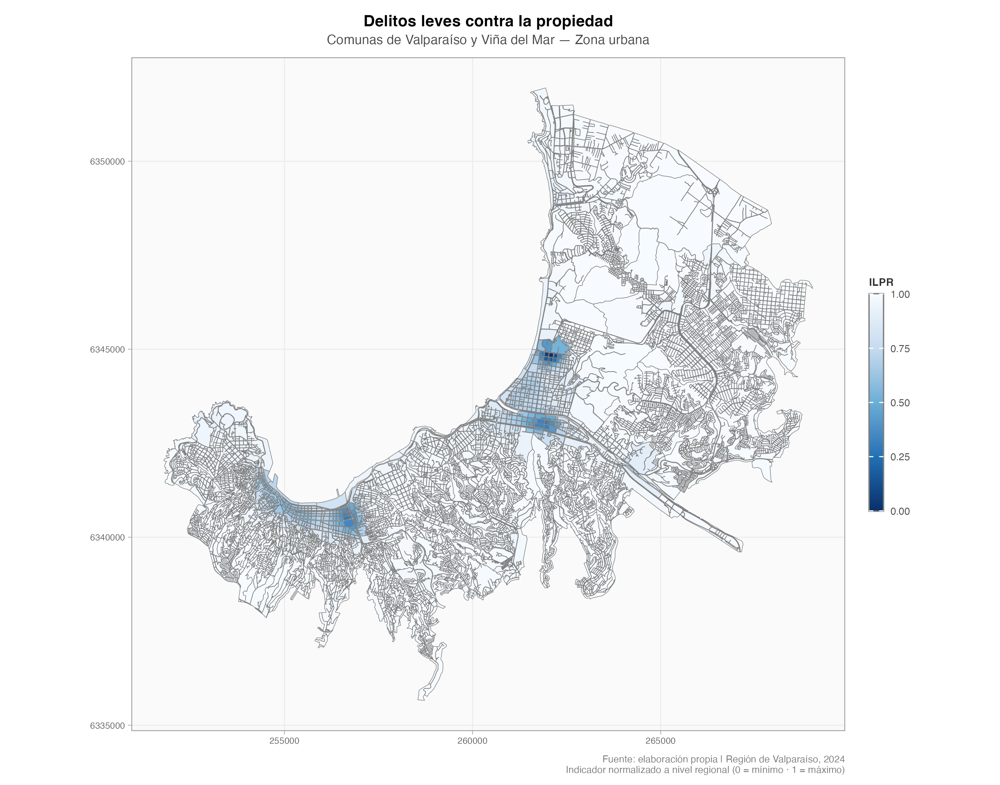

# Dimensión de Seguridad {#sec-seguridad}

## Presentación

Este capítulo describe la dimensión de **seguridad** que forma parte del sistema de indicadores territoriales del centro. La dimensión está compuesta por cuatro indicadores que permiten caracterizar, a nivel de manzana censal, la intensidad y el tipo de actividad delictual que ocurre en cada sector de la ciudad. El objetivo no es simplemente contar cuántos delitos ocurren en un lugar, sino construir una medida de **densidad del fenómeno delictual** que capture dónde se concentra el problema y con qué gravedad se manifiesta.

Los indicadores se actualizan cada vez que se dispone de nueva información oficial de delitos. El proceso que se describe a continuación aplica a cada actualización.


## Fuente de Datos

Los delitos utilizados para construir los indicadores fueron proporcionados por la **Subsecretaría de Prevención del Delito (SPD)** del Ministerio del Interior y Seguridad Pública, y corresponden a todos los **casos policiales ocurridos durante el año 2025** en el territorio nacional.

Un caso policial puede originarse de tres formas distintas:

- **Denuncia:** una persona reporta ante Carabineros o PDI un hecho que considera delito.
- **Flagrancia:** un funcionario policial interviene al sorprender a alguien en la comisión de un delito.
- **Orden de detención:** se ejecuta una detención en cumplimiento de una orden judicial vigente.

Cada caso incluye información sobre el tipo de delito, la fecha y la ubicación georreferenciada donde ocurrió el hecho.


## Anonimización Espacial de los Datos

Los registros originales de delitos contienen la ubicación exacta donde ocurrió cada caso. Para proteger la identidad de víctimas e imputados y cumplir con los estándares de privacidad exigidos para el uso de esta información, **todos los puntos fueron sometidos a un proceso de distorsión espacial aleatoria** antes de ser utilizados en el cálculo de los indicadores.

### ¿En qué consiste la distorsión espacial?

El procedimiento consiste en **desplazar la ubicación original de cada delito a una posición aleatoria dentro de un radio determinado**. En términos simples: en vez de mostrar exactamente en qué dirección o predio ocurrió el hecho, el punto se mueve a un lugar cercano pero distinto, elegido al azar.

El desplazamiento se realizó con los siguientes parámetros:

- **Radio mínimo:** 50 metros desde la ubicación original.
- **Radio máximo:** 100 metros desde la ubicación original.
- La dirección del desplazamiento es completamente aleatoria: el punto puede moverse hacia cualquier ángulo.

Esto significa que cada punto de delito puede encontrarse a entre 50 y 100 metros de donde realmente ocurrió el hecho, en una dirección que no es posible predecir. Esta técnica, conocida como *spatial jittering*, es ampliamente utilizada en criminología y epidemiología espacial para preservar la privacidad sin perder la utilidad analítica de los datos, ya que a escalas de análisis como la manzana o el barrio, la distorsión es suficientemente pequeña como para no afectar los patrones territoriales de interés.


## Las Cuatro Categorías Delictuales

Para construir los indicadores, los delitos no se analizan todos juntos. En cambio, se clasifican en **cuatro categorías** que combinan dos dimensiones: la **gravedad** del delito y el **tipo de bien afectado**.

La gravedad se divide en:

- **Graves:** delitos que implican violencia física, amenaza directa a la integridad de las personas, o un daño patrimonial severo mediante el uso de la fuerza.
- **Leves:** delitos de menor impacto o faltas, que aunque afectan la convivencia no alcanzan la intensidad de los anteriores.

El tipo de bien afectado se divide en:

- **Personas:** el daño recae principalmente sobre la integridad física, psíquica o la libertad de una persona.
- **Propiedad:** el daño recae principalmente sobre bienes materiales o patrimonio.

La combinación de estas dos dimensiones genera las cuatro categorías:

| Indicador | Código | Descripción general |
|-----------|--------|---------------------|
| Graves Personas | IGPE | Delitos violentos contra la integridad física o libertad |
| Leves Personas | ILPE | Faltas y delitos menores contra las personas |
| Graves Propiedad | IGPR | Robos con fuerza o violencia sobre bienes |
| Leves Propiedad | ILPR | Hurtos y delitos menores contra la propiedad |

: Las cuatro categorías de indicadores de seguridad {#tbl-categorias}

### ¿Qué delitos componen cada categoría?

La asignación de cada tipo de delito a una de las cuatro categorías fue definida en base a criterios jurídicos y de política pública, y se materializó en una tabla de clasificación elaborada por el equipo técnico. A continuación se describen los principales grupos delictuales que integran cada categoría.

#### Graves Personas (IGPE)

Agrupa los delitos más severos en términos de daño a las personas. Incluye 66 tipos de delitos, organizados en los siguientes grupos principales:

- **Homicidios y muertes:** homicidios, femicidios, hallazgo de cadáver.
- **Agresiones físicas graves:** lesiones graves, lesiones gravísimas, lesiones con arma de fuego o arma blanca.
- **Delitos sexuales:** violaciones, abusos sexuales, otros delitos sexuales contra menores y adultos.
- **Robos violentos:** robo con violencia o intimidación, robo violento de vehículo motorizado (incluye encerronas y portonazos).
- **Violencia intrafamiliar con lesiones físicas:** casos en que la violencia doméstica genera lesiones de carácter grave.
- **Drogas y armas:** tráfico ilícito de drogas, microtráfico, infracción a ley de armas, porte ilegal de armas.
- **Otros:** extorsión, secuestros, trata de personas, incendios.

#### Leves Personas (ILPE)

Agrupa faltas y delitos de menor gravedad que afectan a las personas o la convivencia. Incluye 39 tipos de delitos, entre los que se encuentran:

- **Lesiones leves:** peleas con lesiones menores que no requieren hospitalización.
- **Violencia intrafamiliar sin lesiones físicas graves:** conflictos domésticos con lesiones psicológicas o de baja intensidad.
- **Incivilidades contra personas:** ebriedad en vía pública, consumo de alcohol o drogas en espacios públicos, desórdenes, mala conducta menor, daños a bienes.
- **Porte de drogas:** tenencia de drogas para consumo personal.
- **Vulneración de derechos:** situaciones que afectan derechos de personas, especialmente niños, niñas y adolescentes.
- **Robo por sorpresa:** robo sin uso de violencia directa (arrebato), que afecta a la persona aunque el bien sustraído sea material.
- **Receptación:** compra o recepción de bienes robados.

#### Graves Propiedad (IGPR)

Agrupa delitos contra la propiedad que implican el uso de la fuerza o la violación de espacios privados. Incluye 5 tipos de delitos:

- **Robo en lugar habitado:** robo en casas o departamentos donde hay personas o donde alguien podría encontrarse.
- **Robo en lugar no habitado con fuerza:** robo en establecimientos, bodegas o lugares cerrados sin moradores.
- **Robo de vehículo motorizado** (modalidad con fuerza directa sobre el vehículo).
- **Robo frustrado:** intento de robo que no se consuma, pero que implicó fuerza o violencia.

#### Leves Propiedad (ILPR)

Agrupa delitos y faltas contra bienes materiales de menor gravedad. Incluye 17 tipos de delitos:

- **Hurtos:** sustracción sin violencia ni fuerza (en tiendas, en la calle, en transporte público).
- **Robo de objeto desde vehículo:** sustracción de pertenencias desde el interior de un automóvil.
- **Robo en lugar no habitado (modalidades menores):** infracciones a recintos cerrados con poco valor sustraído.
- **Comercio ilegal:** venta ambulante no autorizada u otras infracciones comerciales menores.
- **Otros robos con fuerza menores:** modalidades de robo con fuerza que no alcanzan la categoría grave.

::: {.callout-note}
**Nota sobre los delitos sin categoría:** La tabla de clasificación incluye todos los tipos de delitos registrados por la SPD. Aquellos que no tienen asignada una de las cuatro categorías corresponden a delitos que, por su naturaleza (por ejemplo: infracciones de tránsito, delitos económicos, delitos informáticos, hallazgo de vehículos) o por ambigüedad en su clasificación, fueron excluidos del cálculo de los indicadores de seguridad. Esto no significa que no sean importantes, sino que su inclusión podría distorsionar la medición de los fenómenos de seguridad pública que estos indicadores buscan capturar.
:::


## Proceso de Cálculo de los Indicadores

Una vez que los delitos están clasificados en las cuatro categorías, el proceso de cálculo sigue los pasos que se describen a continuación. El objetivo de este proceso es transformar los puntos de delitos en un **valor de densidad para cada manzana censal**, que refleje qué tan intensa es la actividad delictual en ese entorno.

### Paso 1: Preparación de los datos

Antes de cualquier cálculo, todos los datos —tanto los puntos de delitos como los límites de las manzanas censales— se estandarizan en un **sistema de coordenadas común** (EPSG:32719, proyección UTM zona 19 Sur). Esto garantiza que las distancias se calculen en metros reales, lo que es fundamental para el siguiente paso.

Los datos de la Región de Valparaíso merecen una mención especial: por su particularidad geográfica, Isla de Pascua y el Archipiélago Juan Fernández se procesan de forma separada al continente, evitando distorsiones al calcular densidades en territorios insulares muy alejados del continente.

### Paso 2: Cálculo de densidad espacial (KDE)

El corazón del proceso es el cálculo de una **superficie de densidad de puntos**, conocida como *Kernel Density Estimation* o KDE. Esta técnica permite, a partir de una nube de puntos (los delitos), construir una superficie continua que muestra en qué zonas se concentra la actividad.

La idea intuitiva es la siguiente: imagina que en cada delito enciendes una "llamarada" de calor. El calor es más intenso justo donde ocurrió el delito, y se va apagando a medida que te alejas. Al superponer todas las llamaradas, las zonas donde se concentran muchos delitos cercanos entre sí quedan muy calientes, mientras que los sectores sin delitos quedan fríos. El resultado es un mapa de temperatura que representa la intensidad del fenómeno en el espacio.

Los parámetros técnicos del cálculo son:

- **Tamaño de celda:** 100 metros. El territorio se divide en celdas cuadradas de 100 × 100 metros, y para cada una se calcula un valor de densidad.
- **Ancho de banda:** 500 metros. Esta es la distancia hasta la que la influencia de cada delito se propaga. Un delito afecta con fuerza a su entorno inmediato y con menor fuerza a zonas que están hasta 500 metros de distancia.
- **Tipo de kernel:** cuártico (*quartic*). Define la forma matemática con que se distribuye la influencia de cada punto: cae rápidamente desde el centro hacia los bordes.

El cálculo se realiza **por separado para cada región y para cada una de las cuatro categorías**. Esto significa que, por ejemplo, la densidad de Graves Personas en la Región Metropolitana se calcula de forma independiente a la densidad de Leves Propiedad en la misma región, y ambas son independientes de lo que ocurra en otras regiones.

Los mapas a continuación muestran la superficie de densidad KDE resultante para cada uno de los cuatro indicadores. Las zonas más cálidas (colores intensos) concentran mayor actividad delictual; las zonas más frías (colores tenues o transparentes) presentan baja o nula presencia del fenómeno.

::: {.panel-tabset}

## Graves Personas

{fig-alt="Mapa de densidad KDE para delitos graves contra personas" width="100%"}

## Leves Personas

{fig-alt="Mapa de densidad KDE para delitos leves contra personas" width="100%"}

## Graves Propiedad

{fig-alt="Mapa de densidad KDE para delitos graves contra la propiedad" width="100%"}

## Leves Propiedad

{fig-alt="Mapa de densidad KDE para delitos leves contra la propiedad" width="100%"}

:::

### Paso 3: Estrategias de cálculo según el territorio

No todas las regiones tienen la misma forma ni la misma densidad de delitos. Para que el cálculo sea eficiente y produzca resultados de calidad, se aplican distintas estrategias según las características de cada zona:

**Modo directo:** Se usa cuando la región tiene un tamaño manejable. Los puntos de delitos se usan directamente para construir la superficie de densidad.

**Modo H3 con parches contiguos:** Se usa en regiones muy extensas o con zonas rurales dispersas, donde calcular una cuadrícula sobre toda la región resultaría en una superficie con mucho espacio vacío e inútil. En este caso, el territorio se divide en **hexágonos regulares** (usando el sistema H3 de Uber) y el cálculo se realiza solo sobre los hexágonos que efectivamente contienen delitos, agrupándolos en *parches* de hexágonos contiguos. Así se evita desperdiciar capacidad de cómputo en áreas donde no ocurrió nada relevante.

**Modo mixto urbano-rural:** Algunas regiones tienen tanto zonas urbanas densas como extensas áreas rurales. En esos casos, la parte urbana se calcula en modo directo y la parte rural en modo H3, y luego ambas superficies se combinan en un único resultado regional.

### Paso 4: Resumen a nivel de manzana

La superficie KDE es un raster continuo: tiene un valor en cada celda de 100 × 100 metros. Sin embargo, los indicadores del sistema deben expresarse a nivel de **manzana censal** (la unidad territorial mínima del Censo). Para obtener un valor por manzana, se calcula el **promedio de los valores del raster dentro de cada manzana**. Esto se hace con un método de promediado ponderado por área, lo que garantiza que las celdas del raster que caen parcialmente dentro de una manzana se cuenten en proporción a la fracción que efectivamente se superpone.

El resultado de este paso es una tabla con una fila por manzana y una columna por cada una de las cuatro categorías, con el valor bruto de densidad KDE que le corresponde a cada una.

### Paso 5: Normalización a escala de seguridad

Los valores brutos de densidad KDE no tienen una escala intuitiva. Para que los indicadores sean comparables entre categorías y entre versiones del sistema, los valores se **normalizan** para que queden expresados en una escala común. Esta escala permite identificar manzanas con valores muy altos (zonas de alta concentración delictual) y manzanas con valores bajos o nulos (zonas sin presencia significativa del fenómeno).

El resultado final es un conjunto de cuatro indicadores por manzana —IGPE, IGPR, ILPE, ILPR— que pueden leerse, mapearse y compararse de forma directa.


## Resultados por Indicador

Una vez que los valores de densidad KDE han sido resumidos y normalizados a nivel de manzana, el resultado se puede visualizar como una capa de polígonos donde cada manzana censal queda coloreada según la intensidad del indicador correspondiente. Esta representación facilita la lectura territorial del fenómeno: permite identificar de manera directa qué manzanas concentran mayor actividad delictual y cuáles presentan niveles bajos o nulos.

Los mapas a continuación muestran el indicador final expresado sobre las manzanas censales para cada una de las cuatro categorías.

::: {.panel-tabset}

## IGPE

{fig-alt="Mapa de indicador IGPE por manzana censal" width="100%"}

## ILPE

{fig-alt="Mapa de indicador ILPE por manzana censal" width="100%"}

## IGPR

{fig-alt="Mapa de indicador IGPR por manzana censal" width="100%"}

## ILPR

{fig-alt="Mapa de indicador ILPR por manzana censal" width="100%"}

:::


## Formatos de Salida

El proceso produce los siguientes resultados para cada región del país:

- **Capa geoespacial (GeoPackage):** contiene la geometría de cada manzana censal con los cuatro indicadores como atributos. Permite su uso en cualquier sistema de información geográfica (QGIS, ArcGIS, etc.).
- **Raster de densidad (GeoTIFF):** la superficie KDE continua por categoría, útil para visualización y análisis espacial avanzado.
- **Mapas temáticos (PNG):** visualizaciones rápidas del indicador sobre el territorio regional.

Al finalizar el procesamiento de todas las regiones, se genera además una **capa nacional consolidada** que integra los resultados de todas las regiones en un único archivo.


## Resumen del Proceso

El siguiente esquema resume el flujo completo de trabajo, desde los datos originales hasta los indicadores finales:

```
Datos SPD (casos policiales 2025)
       ↓
Distorsión espacial aleatoria (50–100 m)
       ↓
Clasificación en 4 categorías (IGPE / IGPR / ILPE / ILPR)
       ↓
Separación por región geográfica
       ↓
Cálculo de densidad KDE por categoría y región
  (modo directo / H3 parches / mixto según territorio)
       ↓
Resumen del raster a nivel de manzana censal (promedio)
       ↓
Normalización a escala de seguridad
       ↓
Exportación: GeoPackage · GeoTIFF · PNG · consolidado nacional
```


## Consideraciones y Limitaciones

- Los indicadores reflejan **casos policiales registrados**, no la totalidad del fenómeno delictual. Los delitos no denunciados (cifra negra) no están representados.
- La distorsión espacial de 50–100 metros introduce una imprecisión tolerable a escala de manzana o superior, pero **no es recomendable usar los datos desagregados a nivel de predio o punto exacto**.
- La categorización de delitos es una decisión metodológica: algunos delitos aparecen en más de un grupo delictual dependiendo de la modalidad, y su asignación a una categoría puede revisarse en futuras actualizaciones.
- El cálculo KDE es sensible al **ancho de banda** elegido (500 metros). Un ancho mayor suaviza más el mapa; uno menor produce superficies más localizadas. El valor utilizado fue definido como el más adecuado para el nivel de análisis de manzana.
- Los resultados de distintas regiones **no son comparables directamente** en términos de valores absolutos, ya que la normalización se realiza de forma independiente por región. La comparación entre regiones debe realizarse con cautela.
